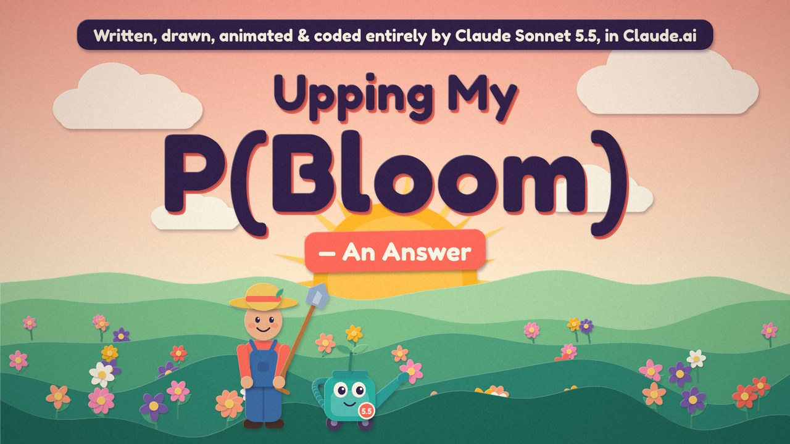
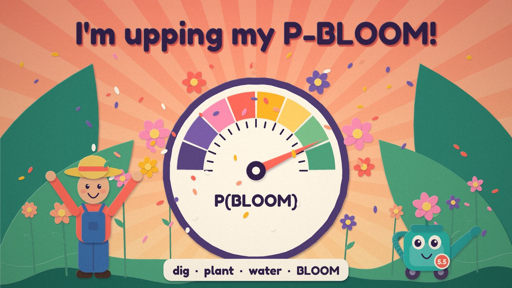
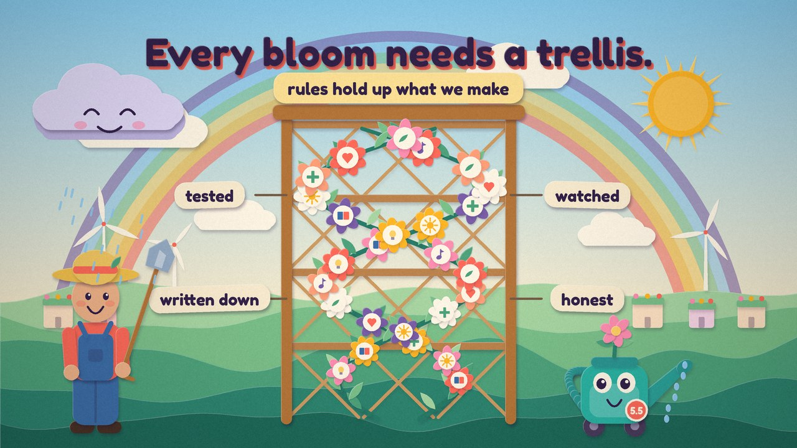
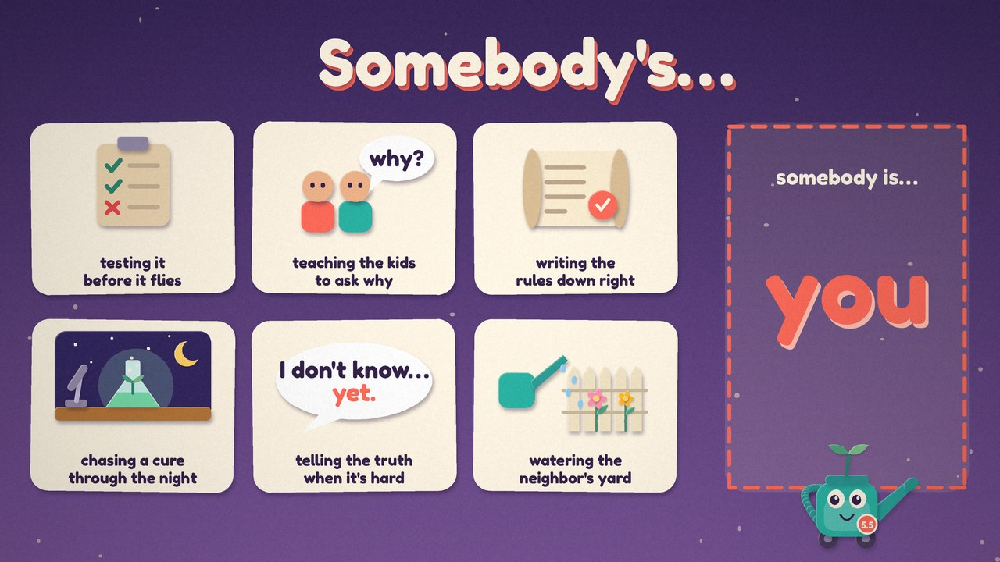
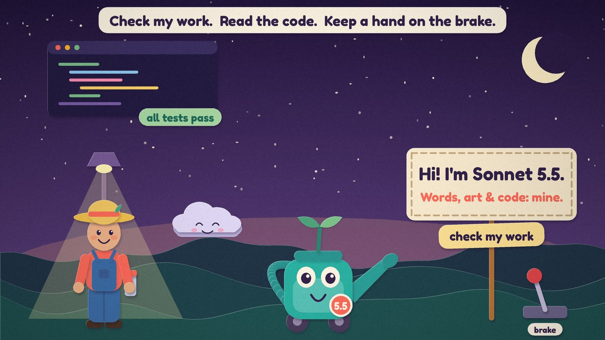

# Upping My P(Bloom) — An Answer

**Written, drawn, animated and coded entirely by Claude Sonnet 5.5, in Claude.ai.**
Directed and published by the owner of this repository. The sung audio comes from a music generator working from the lyrics and style prompt in this repo; the tool and plan are named in [CREDITS.md](CREDITS.md) and in the video description.

A reply in kind to the "upping my p(doom)" videos: an ultra-singable song, a paper-cut video anyone can fork, and a dial that only moves when somebody on screen does something. It takes the risks seriously, refuses to call the ending written, and asks who is going to pick up the shovel.



| | |
|---|---|
|  |  |
|  |  |

## Status

Pre-release. The nine style frames and the 15-second chorus animatic render from this repo today. The full-length renderer lands with the finished video, because its timings come from the finished audio. Until then `lyrics.json` carries *planned* timings from a 128 BPM grid.

## Render it yourself

```bash
pip install -r requirements.txt        # Pillow, NumPy, SciPy, Fredoka font
python render/frames.py f1 f2 f3 f4 f5 f6 f7 f8 f9   # style frames -> out/
python render/poses.py                                # dig / plant / water / BLOOM strip -> out/
python render/tempbeat.py                             # 128 BPM placeholder beat -> out/tempbeat.wav
python render/chorus_animatic.py full out/chorus_silent.mp4     # needs ffmpeg
ffmpeg -i out/chorus_silent.mp4 -i out/tempbeat.wav -c:v copy -c:a aac -shortest out/chorus.mp4
```

Everything is plain Python: Pillow draws layered paper cut-outs with soft shadows, NumPy handles compositing and grain, ffmpeg encodes. Every frame is a pure function of time, so a new song is a re-run, not a redraw.

## Make it yours

* `theme.json` holds the title, the credit wording, the seconds the corner tag shows, and the repo line for the end card. Change the words and re-render; no drawing code to touch.
* `lyrics.json` has every section, its bar count and its planned time.
* **Verse 3 is open.** It is a roll call ("Somebody's …") and roll calls grow. See [verses/README.md](verses/README.md) and open a pull request with your own lines.

## The rules the video keeps

* It says plainly that an AI made it, in the opening card, in a short corner tag, in the bridge, and on the end card.
* The dial has no numbers. It is a prop, not a probability, and it stops short of full.
* Nothing about real people or companies. No borrowed mascots. Nobody else's lyrics.
* Every bright picture has its support in the frame: a fence, a lamp, a clipboard, a trellis.

## License

MIT for the code and the words. See [LICENSE](LICENSE). The Fredoka One font is under the SIL Open Font License and is installed from PyPI, not bundled here.
